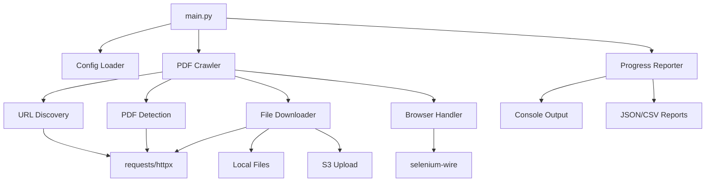

# Design Document

## Overview

The HK PDF Crawler is a straightforward Python script that systematically discovers and downloads PDF documents from Hong Kong government department websites. The design prioritizes simplicity and effectiveness over complexity, using a clean modular structure that's easy to understand, maintain, and extend.

The crawler operates as a single Python script with YAML/JSON configuration, providing clear progress output and comprehensive reporting. It handles common website challenges (JavaScript, forms, rate limiting) with proven libraries and techniques, focusing on reliability and ease of use.

## Architecture

### Simple Script Architecture



### Core Modules

1. **main.py**: Entry point with CLI interface and orchestration
2. **config.py**: Configuration loading and validation
3. **crawler.py**: Main crawling logic and coordination
4. **discovery.py**: URL discovery and PDF link identification
5. **downloader.py**: File download and storage management
6. **browser.py**: Browser automation for JavaScript sites
7. **reporter.py**: Progress tracking and report generation
8. **utils.py**: Common utilities and helpers

## Core Modules

### 1. main.py - Entry Point
```python
def main():
    """Main entry point with CLI interface"""
    parser = argparse.ArgumentParser(description='HK Government PDF Crawler')
    parser.add_argument('--config', required=True, help='Configuration file path (YAML)')
    parser.add_argument('--dry-run', action='store_true', help='Analyze without downloading')
    parser.add_argument('--departments', nargs='+', help='Specific departments to crawl')
    parser.add_argument('--input-urls', help='Path to markdown file with URLs (alternative to config)')
    
    args = parser.parse_args()
    
    # Load configuration from YAML file or create from markdown URLs
    if args.input_urls:
        config = create_config_from_markdown(args.input_urls)
    else:
        config = load_config(args.config)
    
    crawler = PDFCrawler(config)
    
    if args.dry_run:
        report = crawler.dry_run(args.departments)
        print_dry_run_report(report)
    else:
        results = crawler.crawl(args.departments)
        print_final_report(results)

def create_config_from_markdown(markdown_path: str) -> CrawlConfig:
    """Create configuration from markdown file with department URLs"""
    # Parse the provided hk-government-pdf-resources.md file
    # Extract department names and URLs
    # Create default CrawlConfig with parsed data
    pass
```

## Script Input Methods

The Python script accepts input through **two primary methods**:

### Method 1: YAML Configuration File (Recommended)
```bash
python main.py --config config.yaml
python main.py --config config.yaml --dry-run
python main.py --config config.yaml --departments buildings_department labour_department
```

### Method 2: Direct Markdown URL File
```bash
python main.py --input-urls hk-government-pdf-resources.md
python main.py --input-urls hk-government-pdf-resources.md --dry-run
```

The script will automatically parse the provided `hk-government-pdf-resources.md` file and create a default configuration.

### 2. config.py - Configuration Management
```python
@dataclass
class CrawlConfig:
    departments: Dict[str, DepartmentConfig]
    settings: CrawlSettings
    storage: StorageConfig

@dataclass
class DepartmentConfig:
    name: str
    seed_urls: List[str]
    max_depth: int = 3
    max_pages: int = 1000
    time_limit: int = 1800  # 30 minutes

def load_config(config_path: str) -> CrawlConfig:
    """Load configuration from YAML file"""
    with open(config_path, 'r') as f:
        data = yaml.safe_load(f)
    return CrawlConfig(**data)

def create_config_from_markdown(markdown_path: str) -> CrawlConfig:
    """Parse markdown file and create default configuration"""
    departments = {}
    
    with open(markdown_path, 'r') as f:
        content = f.read()
    
    # Parse markdown structure to extract department names and URLs
    current_dept = None
    for line in content.split('\n'):
        if line.startswith('## '):
            # Extract department name
            dept_name = line.replace('## ', '').split(':')[0].strip()
            current_dept = dept_name.lower().replace(' ', '_')
            departments[current_dept] = DepartmentConfig(
                name=dept_name,
                seed_urls=[],
                max_depth=3,
                max_pages=500,
                time_limit=1800
            )
        elif line.strip().startswith('1. **') and current_dept:
            # Extract URL from markdown link
            if 'https://' in line:
                url = line.split('https://')[1].split(')')[0]
                departments[current_dept].seed_urls.append('https://' + url)
    
    return CrawlConfig(
        departments=departments,
        settings=CrawlSettings(),
        storage=StorageConfig()
    )
```

### 3. crawler.py - Main Crawling Logic
```python
class PDFCrawler:
    def __init__(self, config: CrawlConfig):
        self.config = config
        self.session = requests.Session()
        self.browser = None
        self.visited_urls = set()
        self.found_pdfs = []
        
    def crawl(self, departments: List[str] = None) -> CrawlResults:
        """Main crawling method"""
        pass
        
    def dry_run(self, departments: List[str] = None) -> DryRunReport:
        """Analyze without downloading"""
        pass
        
    def crawl_department(self, dept_config: DepartmentConfig) -> DepartmentResults:
        """Crawl a single department"""
        pass
```

### 4. discovery.py - URL and PDF Discovery
```python
class URLDiscovery:
    def __init__(self, session: requests.Session):
        self.session = session
        
    def discover_urls(self, seed_url: str, max_depth: int) -> List[str]:
        """Discover URLs from seed URL"""
        pass
        
    def find_pdf_links(self, url: str) -> List[str]:
        """Find PDF links on a page"""
        pass
        
    def is_pdf_link(self, url: str, link_text: str = "") -> bool:
        """Check if URL points to a PDF"""
        return (url.lower().endswith('.pdf') or 
                'pdf' in link_text.lower() or
                self.validate_pdf_url(url))
```

### 5. downloader.py - File Download and Storage
```python
class FileDownloader:
    def __init__(self, config: StorageConfig):
        self.config = config
        self.s3_client = boto3.client('s3') if config.s3_enabled else None
        
    def download_pdf(self, url: str, department: str) -> DownloadResult:
        """Download a single PDF file"""
        pass
        
    def save_locally(self, content: bytes, file_path: str) -> bool:
        """Save file to local storage"""
        pass
        
    def upload_to_s3(self, content: bytes, s3_key: str) -> bool:
        """Upload file to S3"""
        pass
```

### 6. browser.py - Browser Automation
```python
class BrowserHandler:
    def __init__(self, headless: bool = True):
        self.driver = None
        self.headless = headless
        
    def start_browser(self):
        """Start browser instance when needed"""
        if not self.driver:
            options = webdriver.ChromeOptions()
            if self.headless:
                options.add_argument('--headless')
            self.driver = webdriver.Chrome(options=options)
            
    def handle_interactive_page(self, url: str) -> List[str]:
        """Handle pages requiring JavaScript/interaction"""
        pass
        
    def close_browser(self):
        """Clean up browser resources"""
        if self.driver:
            self.driver.quit()
```

### 7. reporter.py - Progress and Reporting
```python
class ProgressReporter:
    def __init__(self):
        self.stats = defaultdict(int)
        self.start_time = time.time()
        
    def update_progress(self, department: str, action: str, details: str = ""):
        """Update and display progress"""
        pass
        
    def generate_report(self, results: CrawlResults) -> str:
        """Generate final report"""
        pass
        
    def save_report(self, results: CrawlResults, format: str = "json"):
        """Save report to file"""
        pass
```

## Data Models

### Simple Data Structures

```python
@dataclass
class CrawlConfig:
    departments: Dict[str, DepartmentConfig]
    settings: CrawlSettings
    storage: StorageConfig

@dataclass
class DepartmentConfig:
    name: str
    seed_urls: List[str]
    max_depth: int = 3
    max_pages: int = 1000
    time_limit: int = 1800  # 30 minutes
    document_types: List[str] = None  # Filter by doc types

@dataclass
class CrawlSettings:
    delay_between_requests: float = 1.0
    max_concurrent_downloads: int = 5
    respect_robots_txt: bool = True
    user_agent: str = "HK-PDF-Crawler/1.0"
    enable_browser_automation: bool = True
    request_timeout: int = 30

@dataclass
class StorageConfig:
    local_path: str = "./downloads"
    organize_by_department: bool = True
    s3_enabled: bool = False
    s3_bucket: str = None
    s3_prefix: str = None

@dataclass
class DownloadResult:
    url: str
    success: bool
    file_path: str = None
    error: str = None
    file_size: int = 0

@dataclass
class DepartmentResults:
    department: str
    urls_crawled: int
    pdfs_found: int
    pdfs_downloaded: int
    pdfs_failed: int
    pdfs_skipped: int
    total_size: int
    duration: float
    errors: List[str]

@dataclass
class CrawlResults:
    departments: List[DepartmentResults]
    total_pdfs_found: int
    total_pdfs_downloaded: int
    total_duration: float
    success_rate: float

@dataclass
class DryRunReport:
    department_analyses: List[DepartmentAnalysis]
    total_estimated_pdfs: int
    estimated_duration: float
    issues_found: List[str]
    recommendations: List[str]

@dataclass
class DepartmentAnalysis:
    department: str
    seed_urls_accessible: int
    seed_urls_total: int
    estimated_pdfs: int
    requires_browser: bool
    rate_limit_detected: bool
    issues: List[str]
```

## Error Handling

### Simple Error Strategy

```python
def handle_error(error: Exception, context: str, url: str = None) -> bool:
    """
    Simple error handling with logging and retry logic
    Returns True if should retry, False if should skip
    """
    error_msg = f"{context}: {str(error)}"
    if url:
        error_msg += f" (URL: {url})"
    
    logging.error(error_msg)
    
    # Simple retry logic
    if isinstance(error, (requests.ConnectionError, requests.Timeout)):
        return True  # Retry network errors
    elif isinstance(error, requests.HTTPError):
        if error.response.status_code >= 500:
            return True  # Retry server errors
    
    return False  # Skip other errors

def retry_with_backoff(func, max_retries: int = 3, base_delay: float = 1.0):
    """Simple exponential backoff retry decorator"""
    for attempt in range(max_retries):
        try:
            return func()
        except Exception as e:
            if attempt == max_retries - 1:
                raise
            delay = base_delay * (2 ** attempt)
            time.sleep(delay)
```

## Testing Strategy

### Practical Testing Approach

```python
# test_crawler.py
import pytest
from unittest.mock import Mock, patch
import responses

def test_pdf_detection():
    """Test PDF link detection logic"""
    discovery = URLDiscovery(Mock())
    
    assert discovery.is_pdf_link("http://example.com/doc.pdf")
    assert discovery.is_pdf_link("http://example.com/download", "Download PDF")
    assert not discovery.is_pdf_link("http://example.com/page.html")

@responses.activate
def test_download_success():
    """Test successful PDF download"""
    responses.add(responses.GET, "http://example.com/test.pdf", 
                 body=b"PDF content", status=200,
                 headers={"Content-Type": "application/pdf"})
    
    downloader = FileDownloader(StorageConfig())
    result = downloader.download_pdf("http://example.com/test.pdf", "test_dept")
    
    assert result.success
    assert result.file_size > 0

def test_config_loading():
    """Test configuration loading and validation"""
    config = load_config("test_config.yaml")
    assert len(config.departments) > 0
    assert config.settings.delay_between_requests > 0
```

### Manual Testing

- Test with actual HK government websites
- Verify PDF downloads and organization
- Test dry-run mode accuracy
- Validate S3 upload functionality
- Check browser automation on JavaScript sites

## Concurrency Implementation

### Simple Threading Approach

```python
from concurrent.futures import ThreadPoolExecutor, as_completed
import threading
import time

class SimpleConcurrency:
    def __init__(self, max_workers: int = 5):
        self.max_workers = max_workers
        self.domain_locks = {}
        self.last_request_times = {}
        
    def download_pdfs_concurrently(self, pdf_urls: List[str], department: str) -> List[DownloadResult]:
        """Download PDFs with simple thread pool"""
        results = []
        
        with ThreadPoolExecutor(max_workers=self.max_workers) as executor:
            # Submit all download tasks
            future_to_url = {
                executor.submit(self.download_with_rate_limit, url, department): url 
                for url in pdf_urls
            }
            
            # Collect results as they complete
            for future in as_completed(future_to_url):
                url = future_to_url[future]
                try:
                    result = future.result()
                    results.append(result)
                    print(f"Downloaded: {url} ({'Success' if result.success else 'Failed'})")
                except Exception as e:
                    results.append(DownloadResult(url=url, success=False, error=str(e)))
                    
        return results
    
    def download_with_rate_limit(self, url: str, department: str) -> DownloadResult:
        """Download with simple rate limiting"""
        domain = urlparse(url).netloc
        
        # Simple rate limiting per domain
        if domain not in self.domain_locks:
            self.domain_locks[domain] = threading.Lock()
            
        with self.domain_locks[domain]:
            # Ensure minimum delay between requests to same domain
            if domain in self.last_request_times:
                elapsed = time.time() - self.last_request_times[domain]
                if elapsed < 1.0:  # 1 second minimum delay
                    time.sleep(1.0 - elapsed)
            
            self.last_request_times[domain] = time.time()
            
            # Perform actual download
            return self.download_pdf(url, department)
```

## Dry-Run Implementation

### Simple Analysis Approach

```python
def dry_run_analysis(self, departments: List[str] = None) -> DryRunReport:
    """Analyze seed URLs without downloading"""
    analyses = []
    
    for dept_name, dept_config in self.config.departments.items():
        if departments and dept_name not in departments:
            continue
            
        print(f"Analyzing {dept_name}...")
        analysis = self.analyze_department(dept_config)
        analyses.append(analysis)
        
    return DryRunReport(
        department_analyses=analyses,
        total_estimated_pdfs=sum(a.estimated_pdfs for a in analyses),
        estimated_duration=sum(a.estimated_pdfs for a in analyses) * 2.0,  # 2 sec per PDF
        issues_found=self.collect_issues(analyses),
        recommendations=self.generate_recommendations(analyses)
    )

def analyze_department(self, dept_config: DepartmentConfig) -> DepartmentAnalysis:
    """Analyze a single department"""
    accessible_urls = 0
    estimated_pdfs = 0
    requires_browser = False
    rate_limit_detected = False
    issues = []
    
    for seed_url in dept_config.seed_urls:
        try:
            response = self.session.get(seed_url, timeout=10)
            if response.status_code == 200:
                accessible_urls += 1
                
                # Quick PDF count estimation
                pdf_links = self.find_pdf_links_simple(response.text, seed_url)
                estimated_pdfs += len(pdf_links)
                
                # Check if JavaScript is heavily used
                if 'javascript' in response.text.lower() and len(pdf_links) == 0:
                    requires_browser = True
                    
            elif response.status_code == 429:
                rate_limit_detected = True
                issues.append(f"Rate limiting detected on {seed_url}")
                
        except Exception as e:
            issues.append(f"Cannot access {seed_url}: {str(e)}")
    
    return DepartmentAnalysis(
        department=dept_config.name,
        seed_urls_accessible=accessible_urls,
        seed_urls_total=len(dept_config.seed_urls),
        estimated_pdfs=estimated_pdfs,
        requires_browser=requires_browser,
        rate_limit_detected=rate_limit_detected,
        issues=issues
    )

def print_dry_run_report(self, report: DryRunReport):
    """Print simple dry-run report"""
    print("\n" + "="*50)
    print("DRY-RUN ANALYSIS RESULTS")
    print("="*50)
    
    for analysis in report.department_analyses:
        print(f"\n{analysis.department}:")
        print(f"  Accessible URLs: {analysis.seed_urls_accessible}/{analysis.seed_urls_total}")
        print(f"  Estimated PDFs: {analysis.estimated_pdfs}")
        if analysis.requires_browser:
            print(f"  ⚠️  Requires browser automation")
        if analysis.rate_limit_detected:
            print(f"  ⚠️  Rate limiting detected")
        for issue in analysis.issues:
            print(f"  ❌ {issue}")
    
    print(f"\nTotal Estimated PDFs: {report.total_estimated_pdfs}")
    print(f"Estimated Duration: {report.estimated_duration/60:.1f} minutes")
    
    if report.recommendations:
        print("\nRecommendations:")
        for rec in report.recommendations:
            print(f"  • {rec}")
```

## Key Dependencies

### Required Python Libraries

```python
# requirements.txt
requests>=2.28.0           # HTTP requests
beautifulsoup4>=4.11.0     # HTML parsing
selenium>=4.8.0            # Browser automation
pyyaml>=6.0                # Configuration files
boto3>=1.26.0              # AWS S3 (optional)
tqdm>=4.64.0               # Progress bars
urllib3>=1.26.0            # URL utilities
lxml>=4.9.0                # XML parsing for sitemaps
```

### Optional Enhancements

```python
# For better performance (optional)
httpx>=0.24.0              # Async HTTP client
aiofiles>=22.1.0           # Async file operations
cloudscraper>=1.2.60       # Cloudflare bypass
undetected-chromedriver    # Stealth browser automation
```

## Input Formats

### Input Method 1: Markdown URL File
The script can directly process the provided `hk-government-pdf-resources.md` file:

```markdown
# Hong Kong Government Department PDF Resources

## 1. Buildings Department (BD): 
1. **CoP**: https://www.bd.gov.hk/en/resources/codes-and-references/codes-and-design-manuals/index.html
2. **PNAP**: https://www.bd.gov.hk/en/resources/codes-and-references/practice-notes-and-circular-letters/index_pnap.html

## 2. Labour Department (LD):
1. **OSH Legislation**: https://www.labour.gov.hk/eng/legislat/contentB3.htm
2. **Occupational Safety**: https://www.labour.gov.hk/eng/public/content2_8.htm
```

**Usage:**
```bash
python main.py --input-urls hk-government-pdf-resources.md
python main.py --input-urls hk-government-pdf-resources.md --dry-run
```

### Input Method 2: YAML Configuration File

## Configuration Example

### config.yaml
```yaml
departments:
  buildings_department:
    name: "Buildings Department"
    seed_urls:
      - "https://www.bd.gov.hk/en/resources/codes-and-references/codes-and-design-manuals/index.html"
      - "https://www.bd.gov.hk/en/resources/codes-and-references/practice-notes-and-circular-letters/index_pnap.html"
    max_depth: 3
    max_pages: 500
    time_limit: 1800
    
  labour_department:
    name: "Labour Department"
    seed_urls:
      - "https://www.labour.gov.hk/eng/public/content2_8.htm"
    max_depth: 2
    max_pages: 300
    time_limit: 1200

settings:
  delay_between_requests: 1.5
  max_concurrent_downloads: 3
  respect_robots_txt: true
  user_agent: "HK-PDF-Crawler/1.0"
  enable_browser_automation: true
  request_timeout: 30

storage:
  local_path: "./downloads"
  organize_by_department: true
  s3_enabled: false
  s3_bucket: "my-pdf-bucket"
  s3_prefix: "hk-government-pdfs/"
```

**Usage:**
```bash
python main.py --config config.yaml
python main.py --config config.yaml --dry-run
python main.py --config config.yaml --departments buildings_department
```

## Implementation Considerations

### Practical Approach

**Keep It Simple**:
- Single Python script with clear modules
- YAML configuration for easy editing
- Standard libraries where possible
- Clear error messages and logging

**Performance Balance**:
- Moderate concurrency (3-5 threads) to respect websites
- Simple caching using dictionaries and files
- Progress bars for user feedback
- Reasonable timeouts and retries

**Reliability Focus**:
- Graceful error handling with continue-on-error
- Resume capability by checking existing files
- Clear logging for troubleshooting
- Dry-run mode for validation

**User Experience**:
- Clear command-line interface
- Real-time progress updates
- Comprehensive final reports
- Easy configuration management

### File Structure
```
hk-pdf-crawler/
├── main.py              # Entry point
├── config.py            # Configuration handling
├── crawler.py           # Main crawling logic
├── discovery.py         # URL and PDF discovery
├── downloader.py        # File download and storage
├── browser.py           # Browser automation
├── reporter.py          # Progress and reporting
├── utils.py             # Common utilities
├── requirements.txt     # Dependencies
├── config.yaml          # Configuration file
└── README.md           # Usage instructions
```